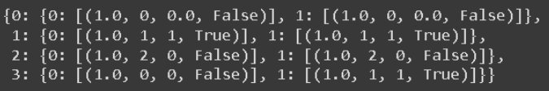

# MDP REPRESENTATION

## AIM:
To represent a Markov Decision Process(MDP) problem in the following ways.

  1.Text representation
  2.Graphical representation
  3.Python - Dictonary representation

## PROBLEM STATEMENT:

### PROBLEM DESCRIPTION
Consider a situation a player(AGENT) is playing in the football field.The aim of the player is to place the ball in goal state.

### STATE SPACE
{BAP,BG,BOB,BWP} - {0,1,2,3} where,

BAP -> Ball is away from the player.
BG -> Ball is in the goal state.
BOB -> Ball is out of the Boundary.
BWP -> Ball is with the player.

### SAMPLE STATE
BAP -> 0

Ball is away from the player.

### ACTION SPACE
{F,K} -{0,1} where,

F -> FALL
K -> KICK

### SAMPLE ACTION
K -> 1

KICK

### REWARD FUNCTION
```
Reward function = { +1, when the ball is in the goal.
                    0, otherwise.
```

### GRAPHICAL REPRESENTATION:


## PYTHON REPRESENTATION:
```
P = {
    0:{
        0: [(1.0,0,0.0,False)],
        1: [(1.0,0,0.0,False)]
        
    },
    1:{
        0: [(1.0,1,1,True)],
        1: [(1.0,1,1,True)]
        
    },
    2:{
        0: [(1.0,2,0,False)],
        1: [(1.0,2,0,False)]
        
    },
    3:{
        0: [(1.0,0,0,False)],
        1: [(1.0,1,1,True)]
        
    }
}
P
```

## OUTPUT:


## RESULT:
Thus, the given real world problem is successfully represented in a MDP form.

